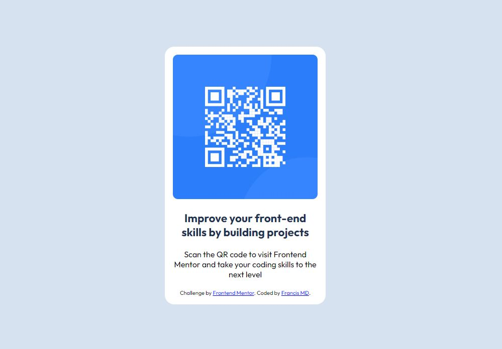

# Frontend Mentor - QR code component solution

## Table of contents

- [Overview](#overview)
  - [Screenshot](#screenshot)
  - [Links](#links)
- [My process](#my-process)
  - [Built with](#built-with)
  - [What I learned](#what-i-learned)
- [Author](#author)

## Overview

### Screenshot




### Links

- Solution URL: https://github.com/Francis-MD/QR-code-component-FEM
- Live Site URL: https://francis-md.github.io/QR-code-component-FEM/

## My process

### Built with

- Semantic HTML5 markup
- CSS custom properties

### What I learned

The difference between the some css selectors:
- element element selector (i.e. div p) which selects all <p> elements inside <div> elements.
- element>element selector (i.e. div > p) which selects all <p> elements where the parent is a <div> element

To see how you can add code snippets, see below:

```css
.proud-of-this-css {
  .card > img {
    max-width: 100%;
    border-radius: 10px;
}

.card > p {
    text-align: center;
    margin-bottom: 20px;
}

}
```
## Author

- Website - [Francis MD](https://www.linkedin.com/in/francismd/)
- Frontend Mentor - [@Francis-MD](https://www.frontendmentor.io/profile/Francis-MD)
- Twitter - [@Francis_MD_](https://twitter.com/Francis_MD_)